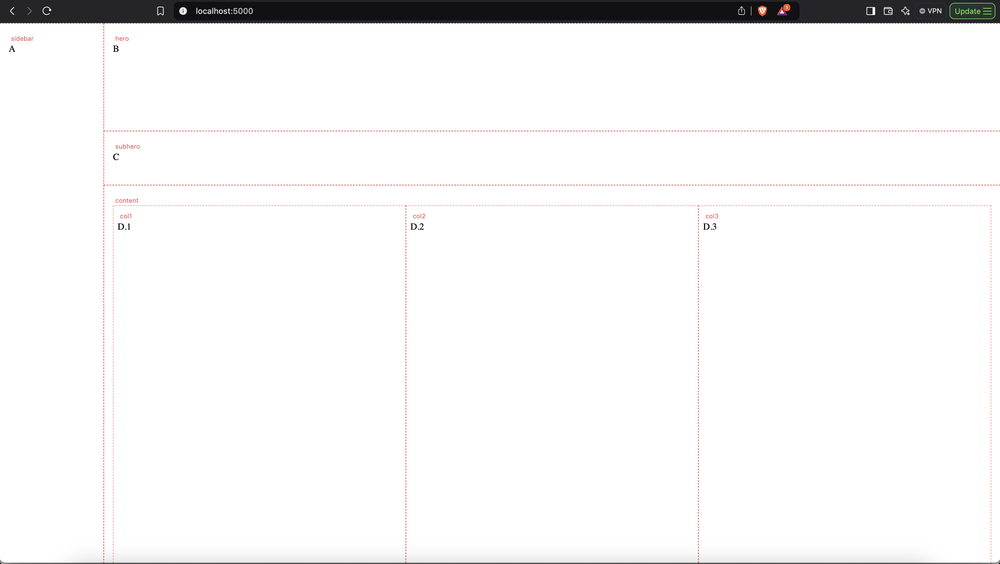

# pydzn-website
A website made with pydzn

## Creating a layout & injecting components
```python
@app.get("/layout-demo")
def demo_layout():
    """
    Construct a layout in debug mode
    """
    from pydzn.grid_builder import layout_builder

    # ----- Outer layout -----
    DashboardLayout = (
        layout_builder()
        .columns(sidebar=180, main="1fr")
        .rows(hero="20vh", subhero="10vh", content="1fr")
        .region("sidebar",  col="sidebar", row=None, row_span=None)
        .region("hero",     col="main",    row="hero")
        .region("subhero",  col="main",    row="subhero")
        .region("content",  col="main",    row="content")
        .build(name="DashboardLayout")
    )

    # ----- Inner sublayout: 3 columns inside content -----
    DashboardContent3Cols = (
        layout_builder()
        .columns(col1="1fr", col2="1fr", col3="1fr")
        .rows(track="1fr")
        .region("col1", col="col1", row="track")
        .region("col2", col="col2", row="track")
        .region("col3", col="col3", row="track")
        .build(name="DashboardContent3Cols")
    )

    from pydzn.components import Button, Text

    content_grid = DashboardContent3Cols(
        region_dzn={"col1": "p-2", "col2": "p-2", "col3": "p-2"}, # column 1 has padding 2px, column 2px has padding 2px and column3 has padding 2px
        debug=True,
    ).render(
        col1=Text(text="D.1").render(),
        col2=Text(text="D.2").render(),
        col3=Text(text="D.3").render(),
    )


    layout = DashboardLayout(
        region_dzn={"sidebar": "bg-elevated p-4", "hero": "p-4", "subhero": "p-4", "dsubhero": "p-4", "content": "p-4"},
        debug=True,
    )

    page_content = layout.render(
        sidebar=Text(text="A").render(),
        hero=Text(text="B").render(),
        subhero=Text(text="C").render(),
        content=content_grid
    )
    return render_template("layout-demo.html", body=page_content)
```

The following route renders the layout in debug mode (red dotted lines visible):


